# 徐工北美备件管理系统

> 工程机械备件供应链的内部数据系统 + AI-native 决策闭环。整合 SAP、CRM 合同、物流、Excel 中的分散数据，输出采购与库存决策所需的信息；并通过全局目标函数（min Z = h·I + 物流 + 缺货 + 呆滞）将每条 AI 决策的业务影响美元化（ΔZ），跟踪历次决策的真实 outcome 形成闭环。

## 背景

工程机械行业的下游客户对备件交付的容忍度极低。一台工程设备停工一天的直接损失在 1-10 万元人民币级别，客户的第一需求不是价格，而是确定的到货时间和尽快到货。但备件供应链的信息流极长、各环节由不同部门和系统承担，以下问题在主机厂和代理商侧长期存在。

**业务层面的三个痛点**

1. **货在哪、什么时候到，没人能给出确定答案。** 一个备件订单进入系统后要经过采购需求、装箱、合同审批、海运、入库、发车多个环节，每个环节的状态数据分散在不同部门和不同系统。使得客户陷入高度不确定性，无法决定是停工、应急采购、租用替代设备还是调派备用机；每多一天不确定，现场的间接损失就多叠加一天。内部业务员同样没有答案，只能逐人电话询问或逐张表核对。

2. **现货满足率低，损失从业务延伸到法务。** 当订单无法从现货满足时，客户满意度和公司声誉直接受损，进而流失订单。更严重的情况下，已承诺的交期因缺货被迫延后，触发合同违约条款，演变为法务纠纷。现货满足率同时是主机厂对代理商的核心 KPI，每一次延期都计入考核。

3. **库存周转率仅 0.05，呆滞备件总额约 2000 万美金。** 为压低缺货率而采用的"多备库存"策略，在长尾物料远多于核心物料的备件结构下走向反面：资金大量沉淀在低周转 SKU 上，形成一边缺货、一边呆滞的局面。仓储费、资金占用、保管成本持续占用净利润。

**数据层面的两个痛点（让上面三个更难解决）**

4. **数据源分散在不同系统（SAP/CRM）和系统的各个角落。** SAP 需求单、装箱清单、合同审批记录、海运舱单、木箱管理清单、手工维护的 Excel 登记簿分别由不同部门持有，格式、更新频率、权限各不相同。回答任何一个跨环节的业务问题，都要先完成一轮跨系统取数和拼表。

5. **字段命名不统一。** 同一物料号在 SAP 里叫"物料号"、合同里叫"备件号"、木箱单里叫"料号"；同一价格字段在不同表中有"PMS 价格"、"PMS 价格(CNY)"、"单价"、"采购单价"等多种写法（参见 [config.py](config.py) 中的 `PROCUREMENT_COL_ALIASES` 别名表）。未经业务标定的原始数据直接喂给通用工具，无法正确聚合。

这五项叠加在一起，解决这个问题的人必须同时具备工程机械备件行业的业务经验和工程实现能力：需要判断哪些 SAP 订单号应从统计中剔除、不同系统中哪些字段实际上是同一个概念、哪类物料不值得投入精细化预测。这类判断深度依赖行业经验。

## 解决方案

系统以"文件夹即数据库"的方式取代原有 Power BI 报表，重构为销售、采购、库存、物流四个板块、共 13 个业务模块。其中四个核心模块的设计思路如下。

### 1. 缺货全链路追踪：采购-物流状态机

**原有做法。** 公司此前由 5-6 名业务员共同维护一张 Excel 总表，各自负责分管订单，手动更新状态。这是最原始的管理手段 —— 信息滞后、口径不一致、人员离职即断档，跨部门问题上实际没有可信数据。

**重构思路。** 梳理 ERP、合同系统、物流系统，找到每一步对应的原始单据（采购需求单 A、装箱单 B、合同单 C、海运舱单 D），以订单号加物料号为关联键，把整条采购-物流流程按业务逻辑串联成一台状态机：从客户下单触发采购需求开始，到货物到港入库结束。任一订单在任一时点都能定位到一个确定的状态节点。

**实现要点。** [core/inventory_engine.py](core/inventory_engine.py) 不新增状态字段、不依赖人工录入，完全通过原始单据之间的差集和连接关系推导状态：A 表有而 B 表无判定为未装箱；C 表有 SAP 销售单号但 D 表无判定为已入库中转仓；以此类推。这套推导的前提是前面所说的字段别名表和排除订单表 —— 源数据干净了，状态机才能成立。

### 2. 库存健康诊断：ROP、安全库存、呆滞识别、缺货预警

模块对每一个在库 SKU 同时输出四项指标。

**再订货点（ROP）和安全库存。** 教科书公式是"ROP = 日均需求 × 交期 + 安全库存"，其中安全库存由需求波动率驱动。工程机械备件的现实是单次订单量小、销售频率低、偶发大单会把需求波动率推到不合理的水平，用这条公式算出的安全库存要么过高、要么失真。本系统改用**交期波动率**驱动安全库存，理由是：备件真正的供应风险不在需求侧，而在交期侧 —— 海运延期、港口拥堵、主机厂合同审批周期不定，这些都是可量化的历史事件。ROP 按 ABC 分类逐个计算，服务系数定义为对应客户停机影响，根据影响大小调整服务系数，由资深服务工程师标注。

**呆滞备件识别。** 基于周转天数和最近销售时点，把长期未动销、沉淀资金的 SKU 标识出来，作为清库存和后续采购决策的负面清单。这一项直接对应上文的 2000 万美金呆滞问题 —— 不识别出来，就无法推动清理。

**缺货预警。** 当"当前库存 + 在途库存 < ROP"时触发，输出待补货清单。这一项直接服务于现货满足率：补货时点前置，才能避免客户订单落到缺货状态。

实现见 [core/inventory_health_engine.py](core/inventory_health_engine.py)。

### 3. 需求预测：ABC-XYZ 分层寻优

系统覆盖的 SKU 总数 16000多 个，其中过去三年有实际销售记录的约 5000+，另外近半数属于全期零销售或极低频销售。即便在有销售记录的活跃 SKU 中，也有相当比例的物料全年销售不足3次。如果对全部物料使用同一套预测模型，计算成本高且在长尾物料上精度极低，反而把有限的预测能力摊薄。

系统采用 ABC-XYZ 双维度分类。ABC 按销售额贡献分三档，XYZ 按销售波动系数分三档：
- **A + X（高贡献 + 稳定）**：核心品类，执行网格搜索寻优参数。
- **C + Z（低贡献 + 离散）**：长尾品类，使用固定经验参数，避免过拟合。
- **中间层**：按预设规则匹配模型。

[core/forecast_engine.py](core/forecast_engine.py) 内置移动平均、加权移动平均、指数平滑三种模型，按物料类别自动选型并输出预测区间。预测输出直接回写到库存健康诊断模块，用于计算日均需求 —— 这是 ROP 和缺货预警的关键输入。

### 4. 在途库存四阶段：避免重复采购

**真正要解决的问题。** 备件空/海运周期30-60天，采购员决定下一批采购量时，如果不清楚有多少货在途，极易发生重复采购：两批近似相同的物料先后下单，到货后在仓库里形成呆滞。这是直接的财务损失，也是呆滞库存的主要来源之一。问题不在财务数字与现场实物对不上，问题在采购决策本身缺少在途可见性。

**解决方案。** 把在途按物理阶段拆分为四段：
- **Stage 1 未装箱。** 采购需求已下达，尚未完成装箱。
- **Stage 2 装箱未合同。** 已装箱，合同尚未审批。
- **Stage 3 合同审批中。** 合同已做，尚未获得 SAP 销售单号。
- **Stage 4 海上在途。** 已出港，尚未到达目的港。

**副产出：供应链堵点识别。** 四个阶段任一发生长时间滞留，都对应一个明确的业务信号 —— Stage 1 滞留指向装箱部门、Stage 3 滞留指向主机厂合同审核、Stage 4 滞留指向物流异常。在解决重复采购问题的同时，系统顺带得到一套供应链流程监控。

**关键判定。** C 表上是否存在 SAP 销售单号，是"审批中"与"已入库中转仓"的分水岭。没有 SAP 销售单号意味着主机厂系统尚未认可该合同，物料仍处于归属待定状态；已有销售单号则表示合同已被主机厂系统认可，物料已划入代理商侧。这条判定规则是主机厂与代理商之间合同流转机制在数据层面的落点。

实现见 [core/inventory_engine.py](core/inventory_engine.py)。

## AI 增强能力

在原有 13 个业务模块之上，2026 春加入一组 AI 能力，把 LLM 的语义理解、主动发现能力和**决策闭环**嵌入到既有数据流。这些能力在侧边栏「🤖 AI 备件助手」板块（10 个独立页）+ 业务模块的 inline 增强 + 全局右下角浮动助手 popover 三种形态呈现。

整体叙事：**标签 → 治理 → 查询 → 决策 → 主动发现 → 联网搜本地 → 行动清单 → outcome 闭环 → 全局目标函数 → 决策影响美元化 → 业务可解释**。

> 设计原则：AI 永远只给候选/起草/建议，不直接动业务计算。所有合并、催单、补货等不可逆动作必须人审通过后才回流主数据。

### 5. AI 简报子系统

每日早 6 点 launchd cron 触发跑批，输出**当前简报**（销售/库存/缺货/采购/物流五段）和**整体分析**（问题诊断 + 建议）两类。Streamlit 落地页直接读 cache，按需触发重生成。

设计要点：
- **多源时效不同**——销售落后约 80 天、采购落后约 60 天、库存落后约 60 天，snapshot 显式记录 freshness，LLM 必须在每段开头标注「数据截至 X，落后 N 天」
- `reference_anchor = max(sales, shipping)` 而非 today —— 避免数据滞后时把所有 stuck_days 算到虚高（"卡了 600 天"这种伪结果）
- 复用业务计算 pipeline（`core/procurement_pipeline.py`、`core/logistics_pipeline.py`），保证简报数字与 dashboard 100% 对账

实现：[core/briefing/](core/briefing/)、[modules/briefing.py](modules/briefing.py)、[scripts/generate_daily_briefing.py](scripts/generate_daily_briefing.py)。

> 📷 截图：`docs/screenshots/01_briefing.png`

### 6. 物料语义标签 + 一物多号去重

**物料语义标签底座**——21K SKU 物料描述靠 LLM 标 `(系统 / 组件 / 关键词)` 三元组：给 dashboard 切片（如"液压系统的健康率"）+ 后续 AI 功能的语义底层。一次跑批 73% 高置信、22% 低置信、5% 中等，落 cache parquet。

**一物多号去重**——物料号变更/多供应商分号入库导致 SKU 号不同实际同件，造成库存被分散计算（每个号 < ROP 但合并 > ROP）+ 重复采购。三阶段递进：

| Phase | 做法 | 实测 |
|---|---|---|
| **A. 文本规范化** | 全角空格 / 规格符号统一 / 去括号备注 / 标点字符（`.` `-`）删除 → exact-after-normalize | 57 高置信组 |
| **B. LLM 语义判定** | 识别括号内中文是规格修饰（达克罗 / 左右）还是品牌备注（正扬 / 宏明） | 127 组 → 43 真合并 + 79 真不同件（达克罗镀层、左右方向是真不同件，不能合）+ 5 待重跑 |
| **C. SAP 替换主数据集成** | 业务签字过的 890 行换号关系 → A 同物多号 vs B 等效替代品 LLM 二分类 | 89 新增对子（2 已合并候选独立确认） |

总收成 **100 高置信合并候选** / ~200 SKU 涉及（57 auto-tier 字面差 + 43 LLM 语义同物）。审核通过的组回流主数据系统由业务流程负责。

**关键发现**：embedding（bge-m3）召回扩规则被 abandon——在备件描述上语义相似度信号是「同类件」而非「同一物理件」（例如 `XCT40_U.02.4-10 滑块` vs `XCT40_U.02.2-10 滑块` cosine ≥ 0.99 但物理上是不同位置的不同件）。真正的同物多号靠字面级标点差和业务签字主数据来 catch，embedding 不是合适工具。这个负结论本身有价值——避免后续在 SaaS 化时重蹈覆辙。

**B 等效替代品独立数据层**：跨品牌/跨机型通用件（徐工挖机 vs 装载机 vs 道路设备）落 `cache/equivalent_substitutes.parquet`，未来给缺货页 + 异常雷达 SKU 卡片提示「⚡ 等效替代候选」用——不混入合并候选避免丢失业务关系。

实现：[core/material_taxonomy.py](core/material_taxonomy.py)、[core/material_dedupe.py](core/material_dedupe.py)、[core/material_replacement.py](core/material_replacement.py)、[modules/dedupe_review.py](modules/dedupe_review.py)。

> 📷 截图：`docs/screenshots/02_dedupe_review.png`

### 7. 智能问答 + 决策助手

LLM tool-use 让业务人不学 SQL，用自然中文问任何 SKU/客户/OEM/物流全链路状态——12 个工具：

| 类别 | 工具 |
|---|---|
| **查询** | search_skus（双路 keyword + bge-m3 embedding） / summarize_sku / find_stockouts / find_top_backorders / query_chain_status / query_undelivered / query_customer_orders / query_oem_delivery_summary |
| **起草** | draft_customer_reply（中英双语客户进度回复） / draft_procurement_alert（中文催单邮件） / draft_reorder_recommendation（中文补货建议，三档优先级 🔴 已欠客户 / ℹ️ 已在采购 / ⚠️ 待采购） |
| **联网** | search_web（Tavily 美国本地供应商调研，含人工核实 disclaimer） |

设计要点：
- **DeepSeek V4-Pro thinking-mode**——reasoning_content 必须透传给下一轮请求，否则 API 报 400
- **embedding 双路召回**——bge-m3 索引 21K SKU 描述，让"漏油的件"这类语义查询能召回油封/油缸/出油块（keyword 搜不到的）。每条结果带 `source: keyword | semantic` 标记
- **起草工具 facts + guidance 模式**——返回结构化事实清单 + 起草指引，让 LLM 灵活包装但禁止编造数字（防幻觉）
- **业务最高频查询 query_chain_status**——查"X 客户订单某件到哪一步"返回 24 字段（缺货/采购/装箱/合同/物流/状态诊断），与缺货全链路追踪页同源数据

实现：[core/sku_query.py](core/sku_query.py)、[core/sku_chat.py](core/sku_chat.py)、[core/embedding.py](core/embedding.py)、[core/web_search.py](core/web_search.py)、[modules/sku_chat.py](modules/sku_chat.py)。

> 📷 截图：`docs/screenshots/03_sku_chat.png`

### 8. 异常雷达

AI 主动扫销售/供应链找"今日值得关注"——不需要业务人提问，AI 推送。4 类信号：

| 类型 | 阈值 | 实测命中 |
|---|---|---|
| 🔴 客户流失风险 | 历史 ≥3 月活跃 + 60 天无新单 | 7 个 |
| 🟡 客户下单突增 | 最近 30 天订单数 z-score ≥ 2.5 | 6 个 |
| 🟠 OEM 严重延期占比高 | 当前严重延期占比 ≥30%（≥90 天） | 5 个 |
| 🟣 SKU 销量突增 | 最近 30 天销量 z ≥ 2.5 | 7 个 |

每个异常 LLM 翻译成业务建议——例如「SR1 Company 过去半年月均 17.5 单已沉默 168 天，建议销售主动回访，排查车队是否停工或转向竞品」。SKU/OEM card 上一键搜美国本地货源（Tavily web search 联动）——实现"AI 发现 OEM 出问题 → AI 帮你查本地解法"业务闭环。

OEM detector 关键决策：从 z-score 突变改为**当前快照排序**——`delivery_cycle_days` 仅对已装箱单有值，最近 30 天提交的单大多还在路上没装箱，时间维度 z-score 永远是负方向（看起来反而更快）。改用"当前严重延期占比 ≥30% 且总样本 ≥15 行"快照排序，业务更直接。

实现：[core/anomaly_customer.py](core/anomaly_customer.py)、[core/anomaly_oem.py](core/anomaly_oem.py)、[core/anomaly_sku.py](core/anomaly_sku.py)、[core/anomaly_llm.py](core/anomaly_llm.py)、[modules/anomaly_radar.py](modules/anomaly_radar.py)。

> 📷 截图：`docs/screenshots/04_anomaly_radar.png`

### 9. 联网搜索（Tavily）

业务背景：默认采购走徐工总部 → 各主机厂；当 OEM 严重延期时业务有当地紧急采购权限，但缺"哪些件能美国本地买"的信息源。LLM 自己不能联网——加 Tavily search tool 让它能查 McMaster / Grainger 等美国工业品分销商。

风险防护：
- tool description 显式禁止 LLM 编造产品编号 / 库存数字 / 链接 URL
- dispatch 自动注入 disclaimer 字段提示「以上为搜索建议，请人工电话/邮件向供应商核实」
- LLM 回答强制 markdown link 格式 `[标题](URL)` —— streamlit 渲染可点击

业务定位：AI 给「调研方向」而非「下单依据」。

实现：[core/web_search.py](core/web_search.py)。集成在智能问答页 + 异常雷达页（OEM/SKU card 一键触发）。

> 📷 截图：`docs/screenshots/05_search_web.png`

### 10. AI 预测助手（事件层修正 + 残差解读）

统计预测（MA / ES / WMA）能给出基线，但看不到「ACME 客户 surge」「徐工铲运严重延期」「保养季节」这类**事件层信号**——这些信号已经在异常雷达里被发现，但不会自动反馈给预测。

AI 预测助手把异常雷达 + OEM 状态 + 回测残差喂给 LLM，每周输出两类提议供业务审核：

- **修正建议**——逐 SKU「baseline X 件 → suggested Y 件，原因 ⋯」+ 三档置信度（high / medium / low）
- **残差解读**——逐 SKU 「accuracy 0.25，因为 ⋯」归因到 6 类（seasonal / event_driven / data_quality / low_volume_noise / trend_shift / other）

**关键设计**：
- **不动 base forecast**——accepted 修正是 overlay 层，base cache 保持纯统计可 reproduce，事件影响一次性的下次跑批 base 自然重新看
- **审核状态分层**——proposed / accepted / rejected / deferred 流转，accepted 才进 overlay
- **物料语义视角融入 prompt**——LLM 不只看数字信号，还要从 desc + system 推断物料属性（消耗类高频件 / 大件低频件 / 标准件 / 季节件），用属性二次校验事件信号合不合理。例如「O 形圈 + 单客户 surge z=2.6」属弱信号 low confidence；「液压油缸总成 + 客户 surge z=3」属强信号 medium-high。reasoning 必须引用描述关键词（让业务能验证 LLM 真看了物料）。

跑批默认只覆盖 ABC=A 类高价值 SKU 避免成本爆。

实现：[core/forecast_adjustment.py](core/forecast_adjustment.py)、[core/forecast_adjustment_llm.py](core/forecast_adjustment_llm.py)、[modules/forecast_adjustment.py](modules/forecast_adjustment.py)。

### 11. 断货风险多因子预测

公式法 normal-CDF 模型（不是 ML / 蒙特卡洛），把库存 + 在途 PO × OEM 可靠度 × 物流到达率 + 客户已欠货 综合算出未来 30 天的断货概率：

```
expected_demand_30d = max(daily_demand × 30, customer_owed_qty)
in_transit_eff      = Σ(undelivered × oem_reliability × logistics_drag)
risk_score          = 1 − Φ((available − demand) / demand_std_30d)
```

业务常量锁：HORIZON=30 天、OEM 严重延期阈值 ≥30%（floor 0.10）、logistics_drag=0.85（保守估计）、风险分桶 0.70/0.30/0.10。

**实测分布合理**：1056 SKU 跑批，缺货预警 SKU 99% 落 high+medium，积压 SKU 94% 落 low+negligible，180 个被标 high 的「正常」SKU 全是 customer_owed > 0 的（模型 catch 了 health_level 漏掉的真实风险）。

**为什么不上 ML**：业务量级（21K SKU、月订单 100-300）不够 train，且 ML 黑盒无法满足业务可解释要求。公式法每个因子对应明确业务含义（OEM 不可靠 → 在途打折扣），结果可追溯。

实现：[core/stockout_risk.py](core/stockout_risk.py)、[core/stockout_risk_llm.py](core/stockout_risk_llm.py)（LLM 解释具体哪个因子拉高了风险）、[modules/stockout_risk.py](modules/stockout_risk.py)。

### 12. 决策闭环：Hub → Tracker → Goal Function → ΔZ Explainability

这是系统从「数据看板」走向「**AI-native 决策系统**」的核心，也是 SaaS 化的真正壁垒所在——**功能能复制，但 outcome 数据复制不了**。

**Decision Hub（决策中心）**——AI 备件助手板块第 1 页（落地页）。把 4 个 source（forecast_proposals / reorder_urgent / customer_followup / dedupe_merge）的所有 AI 建议聚合成「今天该做的行动清单」+ 4 状态流转（accept / reject / defer / 重置）+ 跳转原 source 页查详情。决策卡片显示「**📊 历史 X% 准 (n=N)**」徽章——基于 Outcome Tracker 累积的真实 outcome 给业务直观的可信度参考。

**Outcome Tracker（效果跟踪）**——SaaS 数据壁垒第一砖。所有 accepted 决策到达跟踪窗口（forecast 30 天 / customer churn 90 天 / OEM 60 天 / dedupe 0 天）后，evaluator 拿真实 outcome 跟当时 facts 对比，给 6 档 verdict（correct / wrong / partial / neutral / not_evaluable / pending）。**关键设计：facts 与 verdict 分层**——`facts_at_evaluation` 是评估时刻的客观快照（持久化、不变），`verdict / metric_delta` 基于业务目标判断（可重算）。让 Goal Function 接入后能重算 verdict 不重跑评估。

**Goal Function（全局最优目标函数）**——范式从「最大化 Fill Rate」转到「**最小化期望总损失**」：

```
min Z = h·I + c_sea·Q_sea + c_air·Q_air + p·BO + o·Dead
        持有  海运成本     空运成本      缺货  呆滞
```

实测 20,817 SKU 年总损失 **$22.4M**，缺货占 63.7%（**$14.3M，主战场**）> 持有 15.7% > 呆滞 18.7% > 海运 1.9%。验证业务直觉：「不是库存太多，是关键件缺得太厉害」。停机成本表（液压系统 $780/天、动力系统 $1000/天、标识件 $52/天 等）+ K_i 5 维度评分（downtime_impact / demand_frequency / fleet_size / lt_risk / margin_value）混合 dealer 直接损失 + α=0.4 终端损失传导。

**ΔZ 美元化**——Decision Hub 卡片标题加「💰 预估省 $X.XK/年」+ KPI 第 4 列「💰 待审预估省/年」（业务老板最爱）；Outcome Tracker KPI 第 5 列「💰 AI 创造净价值/年」（correct → 正 ΔZ，wrong → 负 ΔZ）。把 AI 决策从抽象准确率升级到具体美元价值。救援率业务签字常量（reorder=0.70 / forecast=0.30×conf / customer_followup=0.30 / oem_escalation=0.30）。

**ΔZ Explainability（4 层渐进披露）**——业务原话「$X 数字看到了，但需要知道怎么算的」。AI 黑箱业务不会信任。4 层：
1. **L1 卡片标题**——`💰 预估省 $X.XK/年` + `⭐ ≥$5K 高价值标记`
2. **L2 卡片内 expander**——「💡 这 $X 怎么算的」展开后显示：公式 + 输入数字表（值 / 标签 / source 三段）+ 业务解释 + ⚠️ 不确定性提示。**高价值（≥$5K）默认展开 + st.warning 加强**
3. **L3 排序与切换**——高价值置顶 / KPI 第 3 列条件切换「⭐ 高价值待审」
4. **L4 KPI tooltip**——by decision_type 完整公式 + 数据 source 注明

实务意义：业务看到 "$30K" 不再黑箱——点开看「OEM 未交付 $100K × 30% 改善率 = $30K（保守假设）」+ ⚠️ 30% 改善率因 OEM 配合度差异大不一定准。

实现：[core/decision_hub.py](core/decision_hub.py)、[core/outcome_tracker.py](core/outcome_tracker.py)、[core/goal_function.py](core/goal_function.py)、[modules/decision_hub.py](modules/decision_hub.py)、[modules/outcome_tracker.py](modules/outcome_tracker.py)、[modules/goal_function.py](modules/goal_function.py)。

> 📷 截图：`docs/screenshots/06_decision_hub.png`、`07_outcome_tracker.png`、`08_goal_function.png`

### 13. 全局 AI 助手 popover

右下角浮动 💬 按钮——每个页面都看得见，点击展开 popover 内嵌 chat，无需切页。**page-aware system prompt** 自动注入「用户当前在 XX 页」+ 业务 hint，让"这个页面的 X"类问题能 ground 到正确数据。19 页全覆盖。

独立 history（与主智能问答页隔离）+ `@cache_resource` 全局 ToolsContext 避免每次切页重 build 7 个 df。技术取舍：popover 是 inline 不是真"右下角浮动 panel"——streamlit 限制使然。要更接近真客服机器人需要 React iframe（5-7 天）。先用 popover 验证使用频率，频率高再升级。

实现：[modules/global_chat.py](modules/global_chat.py)。

### 技术选型

Streamlit + Pandas + Plotly 是当前数据规模（月订单 100-300 条、10000+ SKU 主数据）下的务实选择：
- 该量级无需数据库，本地 Excel 目录驱动即可；
- 核心逻辑（多表 join、分类预测、自定义公式）超出 DAX 表达能力，用 Python 直接实现更可控；
- 使用者是非技术业务员，Streamlit 免运维、可直接部署到 Streamlit Cloud，降低长期维护成本。

代价是单页应用对性能敏感。通过在数据加载层添加 `@st.cache_data`，核心搜索响应从 10-30 秒压到 <100ms（详见 [docs/archive/OPTIMIZATION_REPORT.md](docs/archive/OPTIMIZATION_REPORT.md)）。

### 指标体系

四个板块共 13 个业务模块最终落地的指标如下。

| 板块 | 模块 | 输出指标 |
|------|------|---------|
| 销售 | 销售看板 | 总销售额、订单总数、现货满足率、客户数、按月销售趋势、Top 客户、销售区域热力图 |
| 销售 | 待发货清单 | 待发货订单数、待发货金额、待发货天数分布、逾期订单 |
| 销售 | 缺货分析 | 缺货订单数、缺货率、Top 缺货物料、缺货原因分类 |
| 销售 | 缺货全链路追踪 | 状态机各节点（采购需求 → 装箱 → 合同 → 审批 → 海运 → 入库 → 发车）的订单数与金额、单订单时点状态、卡点部门定位 |
| 销售 | 需求预测 | 月度预测值、预测区间、ABC-XYZ 分类分布、自动选型结果、预测 vs 实际偏差 |
| 采购 | 采购看板 | 总采购额、采购订单数、平均采购单价、币种分布、按 OEM 的采购占比 |
| 采购 | 采购交付分析 | 采购交付周期（下单 → 入库）、延期率、按 OEM 的交期分布、交期标准差（用于安全库存计算） |
| 库存 | 库存追踪 | 四阶段在途数量（未装箱 / 装箱未合同 / 合同审批中 / 海上在途）、在途总金额、按 SKU 明细、按阶段滞留天数 |
| 库存 | 库存健康诊断 | 再订货点 ROP、安全库存、库存周转天数、呆滞 SKU 清单、缺货预警清单、ABC 分类健康评分 |
| 物流 | 物流看板 | 总运费、运费趋势、发运方式分布、平均运费单价 |
| 物流 | 在途预警 | 海上在途数量与金额、预计到港日期、逾期在途清单 |
| 物流 | 合同未发出 | 未发出合同数量与金额、合同滞留天数分布 |
| 物流 | 待发木箱 | 待发木箱数量、重量、体积、按目的地分布 |

以上指标之间存在数据依赖关系：需求预测的月度预测值回写到库存健康诊断模块，用于计算日均需求，进而驱动 ROP 和缺货预警；采购交付分析输出的交期标准差进入安全库存公式；在途库存四阶段的数量直接作为缺货预警的输入之一。模块并非各自独立的看板，是一套相互咬合的指标系统。

## 系统架构

```mermaid
flowchart LR
    subgraph Source[数据源 · 文件夹驱动]
        S[sales / procurement<br/>inventory / logistics]
    end
    subgraph Core[核心引擎 core/]
        E1[data_engine<br/>多文件合并去重]
        E2[inventory_engine<br/>四阶段在途 + 状态机]
        E3[health_engine<br/>ROP / 安全库存 / 呆滞 / 预警]
        E4[forecast_engine<br/>ABC-XYZ 分层预测]
        E5[taxonomy / dedupe / replacement<br/>语义标签 + 一物多号 + 替换主数据]
        E6[anomaly_*<br/>4 类异常 detector]
        E7[stockout_risk<br/>normal-CDF 多因子]
        E8[forecast_adjustment<br/>事件层修正]
        E9[decision_hub / outcome_tracker / goal_function<br/>决策闭环 + ΔZ 美元化]
    end
    subgraph LLM[LLM 增强层]
        L1[DeepSeek V4-Pro<br/>chat / 翻译 / 起草]
        L2[bge-m3<br/>embedding 索引]
        L3[Tavily<br/>web search]
    end
    subgraph Cache[cache/ parquet]
        C1[taxonomy / dedupe<br/>anomaly / briefing]
    end
    subgraph Modules[模块 modules/]
        M1[13 业务模块]
        M2[10 AI 备件助手页]
        M3[全局浮动 popover]
    end
    Source --> Core
    Core <--> LLM
    Core --> Cache
    Cache --> Modules
    Core --> Modules
    Modules --> UI[Streamlit Web UI]
```



数据流主线：Excel 按业务域分文件夹 → 核心引擎按订单号对齐 → 业务模块组合指标 → Streamlit 渲染。

AI 增强分支：核心引擎 + LLM 协作产出语义标签、去重候选、异常信号、AI 简报，全部落 cache parquet 供模块层读取（解耦请求路径，避免页面打开转圈调 LLM）。全流程不依赖数据库。

## 行业数据壁垒

以下四处代码结构体现了该系统与通用数据工具的区别。它们不是工程设计的产物，是业务运行中积累出来的规则。

**SAP 订单号作为信息流主键。** 系统不使用自增 ID，以 SAP 订单号贯穿全链路。配合手工维护的 [config/excluded_orders.json](config/excluded_orders.json)，在 A、B、C 三张表中**同时**过滤掉 22 个已识别为退货、取消或测试的订单号。这条规则的关键在"同时"——单表过滤会让各环节范围不一致，推导状态机时就会错位。这种规则只能靠业务经验沉淀，无法从代码或通用 AI 工具推导出来。

**PMS 价格按 `max()` 聚合。** 同一订单同一物料会出现多条价格记录（改单、重报价、币种调整），按行业默认约定，聚合时取最大值代表最新或最高报价。见 [core/inventory_engine.py](core/inventory_engine.py)。

**"合同是否有 SAP 销售单号"决定库存归属。** 这条一行判定浓缩了主机厂与代理商之间完整的合同流转机制，直接决定在途计算口径，详见前文第 4 模块。

**十余个针对真实 SKU 的调试脚本。** 如 `check_part_802138302.py`、`check_part_xxx.py` 等，是处理真实北美订单数据时针对异常数据逐一排查沉淀下来的。它们的存在本身是系统跑过真实业务的证据。

## 当前状态

- 在徐工北美备件团队内部使用，已替代原 Power BI 报表。
- 数据规模：SKU 主数据 21,098（过去三年有销售记录的约 5,000+），月订单量 100-300 条，历史订单积累两年以上。
- 性能：核心搜索响应 <100ms，缓存命中时页面加载 <1 秒（详见 [docs/archive/OPTIMIZATION_REPORT.md](docs/archive/OPTIMIZATION_REPORT.md)）。
- 模块覆盖：13 个传统业务模块 + **AI 备件助手 10 页**（决策中心 / 效果跟踪 / 目标函数 / 当前简报 / 整体分析 / 一物多号审核 / 智能问答 / 异常雷达 / 断货风险 / AI 预测助手）+ 全局右下角浮动助手 popover。
- 测试覆盖：**1127 单测**覆盖核心业务规则（z-score 阈值、SLA 天数、合并准则、ΔZ 救援率、Goal Function 业务常量、物料语义视角 prompt 锁定等）。所有改业务定义的测试都加注「改这数字要业务签字」。
- LLM 用量：DeepSeek V4-Pro chat（thinking-mode）+ SiliconFlow bge-m3（embedding，21K SKU 全量索引）+ Tavily（web search）。三家 API 解耦，可独立切换。LLM 跑批后 cache 落 parquet，运行时不调 LLM 保证可用性。
- AI 战绩举例：Goal Function 算出年总损失 $22.4M（缺货占 $14.3M 主战场）；100 个高置信合并候选；10+ 个客户/OEM/SKU 异常持续监控；事件层修正建议每周供 A 类高价值 SKU 业务审核。
- 工程成熟度：仍在迭代阶段，模块拆分、core 抽包、调试脚本清理等仓库卫生项有待完善。

## 作者

作者在工程机械行业从事销售与备件管理，项目数据来源于真实业务场景，由作者独立设计与开发。
