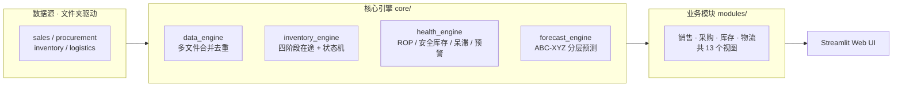

# 徐工北美备件管理系统

> 工程机械备件供应链的内部数据系统，用于整合 SAP、CRM合同、物流、Excel 中的分散数据，输出采购与库存决策所需的信息。

## 背景

工程机械行业的下游客户对备件交付的容忍度极低。一台工程设备停工一天的直接损失在 1-10 万元人民币级别，客户的第一需求不是价格，而是确定的到货时间和尽快到货。但备件供应链的信息流极长、各环节由不同部门和系统承担，以下问题在主机厂和代理商侧长期存在。

**业务层面的三个痛点**

1. **货在哪、什么时候到，没人能给出确定答案。** 一个备件订单进入系统后要经过采购需求、装箱、合同审批、海运、入库、发车多个环节，每个环节的状态数据分散在不同部门和不同系统。使得客户陷入高度不确定性，无法决定是停工、应急采购、租用替代设备还是调派备用机；每多一天不确定，现场的间接损失就多叠加一天。内部业务员同样没有答案，只能逐人电话询问或逐张表核对。

2. **现货满足率低，损失从业务延伸到法务。** 当订单无法从现货满足时，客户满意度和公司声誉直接受损，进而流失订单。更严重的情况下，已承诺的交期因缺货被迫延后，触发合同违约条款，演变为法务纠纷。现货满足率同时是主机厂对代理商的核心 KPI，每一次延期都计入考核。

3. **库存周转率仅 0.05，呆滞备件总额约 2000 万美金。** 为压低缺货率而采用的"多备库存"策略，在长尾物料远多于核心物料的备件结构下走向反面：资金大量沉淀在低周转 SKU 上，形成一边缺货、一边呆滞的局面。仓储费、资金占用、保管成本持续占用净利润。

**数据层面的两个痛点（让上面三个更难解决）**

4. **数据源分散在不同系统（SAP/CRM）和系统的各个角落。** SAP 需求单、装箱清单、合同审批记录、海运舱单、木箱管理清单、手工维护的 Excel 登记簿分别由不同部门持有，格式、更新频率、权限各不相同。回答任何一个跨环节的业务问题，都要先完成一轮跨系统取数和拼表。

5. **字段命名不统一。** 同一物料号在 SAP 里叫"物料号"、合同里叫"备件号"、木箱单里叫"料号"；同一价格字段在不同表中有"PMS 价格"、"PMS 价格(CNY)"、"单价"、"采购单价"等多种写法（参见 [config.py](config.py) 中的 `PROCUREMENT_COL_ALIASES` 别名表）。未经业务标定的原始数据直接喂给通用工具，无法正确聚合。

这五项叠加在一起，解决这个问题的人必须同时具备工程机械备件行业的业务经验和工程实现能力：需要判断哪些 SAP 订单号应从统计中剔除、不同系统中哪些字段实际上是同一个概念、哪类物料不值得投入精细化预测。这类判断深度依赖行业经验。

## 解决方案

系统以"文件夹即数据库"的方式取代原有 Power BI 报表，重构为销售、采购、库存、物流四个板块、共 13 个业务模块。其中四个核心模块的设计思路如下。

### 1. 缺货全链路追踪：采购-物流状态机

**原有做法。** 公司此前由 5-6 名业务员共同维护一张 Excel 总表，各自负责分管订单，手动更新状态。这是最原始的管理手段 —— 信息滞后、口径不一致、人员离职即断档，跨部门问题上实际没有可信数据。

**重构思路。** 梳理 ERP、合同系统、物流系统，找到每一步对应的原始单据（采购需求单 A、装箱单 B、合同单 C、海运舱单 D），以订单号加物料号为关联键，把整条采购-物流流程按业务逻辑串联成一台状态机：从客户下单触发采购需求开始，到货物到港入库结束。任一订单在任一时点都能定位到一个确定的状态节点。

**实现要点。** [core/inventory_engine.py](core/inventory_engine.py) 不新增状态字段、不依赖人工录入，完全通过原始单据之间的差集和连接关系推导状态：A 表有而 B 表无判定为未装箱；C 表有 SAP 销售单号但 D 表无判定为已入库中转仓；以此类推。这套推导的前提是前面所说的字段别名表和排除订单表 —— 源数据干净了，状态机才能成立。

### 2. 库存健康诊断：ROP、安全库存、呆滞识别、缺货预警

模块对每一个在库 SKU 同时输出四项指标。

**再订货点（ROP）和安全库存。** 教科书公式是"ROP = 日均需求 × 交期 + 安全库存"，其中安全库存由需求波动率驱动。工程机械备件的现实是单次订单量小、销售频率低、偶发大单会把需求波动率推到不合理的水平，用这条公式算出的安全库存要么过高、要么失真。本系统改用**交期波动率**驱动安全库存，理由是：备件真正的供应风险不在需求侧，而在交期侧 —— 海运延期、港口拥堵、主机厂合同审批周期不定，这些都是可量化的历史事件。ROP 按 ABC 分类逐个计算，服务系数定义为对应客户停机影响，根据影响大小调整服务系数，由资深服务工程师标注。

**呆滞备件识别。** 基于周转天数和最近销售时点，把长期未动销、沉淀资金的 SKU 标识出来，作为清库存和后续采购决策的负面清单。这一项直接对应上文的 2000 万美金呆滞问题 —— 不识别出来，就无法推动清理。

**缺货预警。** 当"当前库存 + 在途库存 < ROP"时触发，输出待补货清单。这一项直接服务于现货满足率：补货时点前置，才能避免客户订单落到缺货状态。

实现见 [core/inventory_health_engine.py](core/inventory_health_engine.py)。

### 3. 需求预测：ABC-XYZ 分层寻优

系统覆盖的 SKU 总数 16000多 个，其中过去三年有实际销售记录的约 5000+，另外近半数属于全期零销售或极低频销售。即便在有销售记录的活跃 SKU 中，也有相当比例的物料全年销售不足3次。如果对全部物料使用同一套预测模型，计算成本高且在长尾物料上精度极低，反而把有限的预测能力摊薄。

系统采用 ABC-XYZ 双维度分类。ABC 按销售额贡献分三档，XYZ 按销售波动系数分三档：
- **A + X（高贡献 + 稳定）**：核心品类，执行网格搜索寻优参数。
- **C + Z（低贡献 + 离散）**：长尾品类，使用固定经验参数，避免过拟合。
- **中间层**：按预设规则匹配模型。

[core/forecast_engine.py](core/forecast_engine.py) 内置移动平均、加权移动平均、指数平滑三种模型，按物料类别自动选型并输出预测区间。预测输出直接回写到库存健康诊断模块，用于计算日均需求 —— 这是 ROP 和缺货预警的关键输入。

### 4. 在途库存四阶段：避免重复采购

**真正要解决的问题。** 备件空/海运周期30-60天，采购员决定下一批采购量时，如果不清楚有多少货在途，极易发生重复采购：两批近似相同的物料先后下单，到货后在仓库里形成呆滞。这是直接的财务损失，也是呆滞库存的主要来源之一。问题不在财务数字与现场实物对不上，问题在采购决策本身缺少在途可见性。

**解决方案。** 把在途按物理阶段拆分为四段：
- **Stage 1 未装箱。** 采购需求已下达，尚未完成装箱。
- **Stage 2 装箱未合同。** 已装箱，合同尚未审批。
- **Stage 3 合同审批中。** 合同已做，尚未获得 SAP 销售单号。
- **Stage 4 海上在途。** 已出港，尚未到达目的港。

**副产出：供应链堵点识别。** 四个阶段任一发生长时间滞留，都对应一个明确的业务信号 —— Stage 1 滞留指向装箱部门、Stage 3 滞留指向主机厂合同审核、Stage 4 滞留指向物流异常。在解决重复采购问题的同时，系统顺带得到一套供应链流程监控。

**关键判定。** C 表上是否存在 SAP 销售单号，是"审批中"与"已入库中转仓"的分水岭。没有 SAP 销售单号意味着主机厂系统尚未认可该合同，物料仍处于归属待定状态；已有销售单号则表示合同已被主机厂系统认可，物料已划入代理商侧。这条判定规则是主机厂与代理商之间合同流转机制在数据层面的落点。

实现见 [core/inventory_engine.py](core/inventory_engine.py)。

### 技术选型

Streamlit + Pandas + Plotly 是当前数据规模（月订单 100-300 条、10000+ SKU 主数据）下的务实选择：
- 该量级无需数据库，本地 Excel 目录驱动即可；
- 核心逻辑（多表 join、分类预测、自定义公式）超出 DAX 表达能力，用 Python 直接实现更可控；
- 使用者是非技术业务员，Streamlit 免运维、可直接部署到 Streamlit Cloud，降低长期维护成本。

代价是单页应用对性能敏感。通过在数据加载层添加 `@st.cache_data`，核心搜索响应从 10-30 秒压到 <100ms（详见 [OPTIMIZATION_REPORT.md](OPTIMIZATION_REPORT.md)）。

### 指标体系

四个板块共 13 个业务模块最终落地的指标如下。

| 板块 | 模块 | 输出指标 |
|------|------|---------|
| 销售 | 销售看板 | 总销售额、订单总数、现货满足率、客户数、按月销售趋势、Top 客户、销售区域热力图 |
| 销售 | 待发货清单 | 待发货订单数、待发货金额、待发货天数分布、逾期订单 |
| 销售 | 缺货分析 | 缺货订单数、缺货率、Top 缺货物料、缺货原因分类 |
| 销售 | 缺货全链路追踪 | 状态机各节点（采购需求 → 装箱 → 合同 → 审批 → 海运 → 入库 → 发车）的订单数与金额、单订单时点状态、卡点部门定位 |
| 销售 | 需求预测 | 月度预测值、预测区间、ABC-XYZ 分类分布、自动选型结果、预测 vs 实际偏差 |
| 采购 | 采购看板 | 总采购额、采购订单数、平均采购单价、币种分布、按 OEM 的采购占比 |
| 采购 | 采购交付分析 | 采购交付周期（下单 → 入库）、延期率、按 OEM 的交期分布、交期标准差（用于安全库存计算） |
| 库存 | 库存追踪 | 四阶段在途数量（未装箱 / 装箱未合同 / 合同审批中 / 海上在途）、在途总金额、按 SKU 明细、按阶段滞留天数 |
| 库存 | 库存健康诊断 | 再订货点 ROP、安全库存、库存周转天数、呆滞 SKU 清单、缺货预警清单、ABC 分类健康评分 |
| 物流 | 物流看板 | 总运费、运费趋势、发运方式分布、平均运费单价 |
| 物流 | 在途预警 | 海上在途数量与金额、预计到港日期、逾期在途清单 |
| 物流 | 合同未发出 | 未发出合同数量与金额、合同滞留天数分布 |
| 物流 | 待发木箱 | 待发木箱数量、重量、体积、按目的地分布 |

以上指标之间存在数据依赖关系：需求预测的月度预测值回写到库存健康诊断模块，用于计算日均需求，进而驱动 ROP 和缺货预警；采购交付分析输出的交期标准差进入安全库存公式；在途库存四阶段的数量直接作为缺货预警的输入之一。模块并非各自独立的看板，是一套相互咬合的指标系统。

## 系统架构

数据流是一条纯计算管道：Excel 按业务域分文件夹存放 → 核心引擎按订单号对齐并推导状态 → 业务模块按视角组合指标 → Streamlit 渲染输出。全流程不依赖数据库。

## 行业数据壁垒

以下四处代码结构体现了该系统与通用数据工具的区别。它们不是工程设计的产物，是业务运行中积累出来的规则。

**SAP 订单号作为信息流主键。** 系统不使用自增 ID，以 SAP 订单号贯穿全链路。配合手工维护的 [config/excluded_orders.json](config/excluded_orders.json)，在 A、B、C 三张表中**同时**过滤掉 22 个已识别为退货、取消或测试的订单号。这条规则的关键在"同时"——单表过滤会让各环节范围不一致，推导状态机时就会错位。这种规则只能靠业务经验沉淀，无法从代码或通用 AI 工具推导出来。

**PMS 价格按 `max()` 聚合。** 同一订单同一物料会出现多条价格记录（改单、重报价、币种调整），按行业默认约定，聚合时取最大值代表最新或最高报价。见 [core/inventory_engine.py](core/inventory_engine.py)。

**"合同是否有 SAP 销售单号"决定库存归属。** 这条一行判定浓缩了主机厂与代理商之间完整的合同流转机制，直接决定在途计算口径，详见前文第 4 模块。

**十余个针对真实 SKU 的调试脚本。** 如 `check_part_802138302.py`、`check_part_xxx.py` 等，是处理真实北美订单数据时针对异常数据逐一排查沉淀下来的。它们的存在本身是系统跑过真实业务的证据。

## 当前状态

- 在徐工北美备件团队内部使用，已替代原 Power BI 报表。
- 数据规模：SKU 主数据 10000+（过去三年有销售记录的约 5000+），月订单量 100-300 条，历史订单积累两年以上。
- 性能：核心搜索响应 <100ms，缓存命中时页面加载 <1 秒（详见 [OPTIMIZATION_REPORT.md](OPTIMIZATION_REPORT.md)）。
- 工程成熟度：仍在迭代阶段，测试覆盖、模块拆分、调试脚本清理等仓库卫生项有待完善。

## 作者

作者在工程机械行业从事销售与备件管理，项目数据来源于真实业务场景，由作者独立设计与开发。
